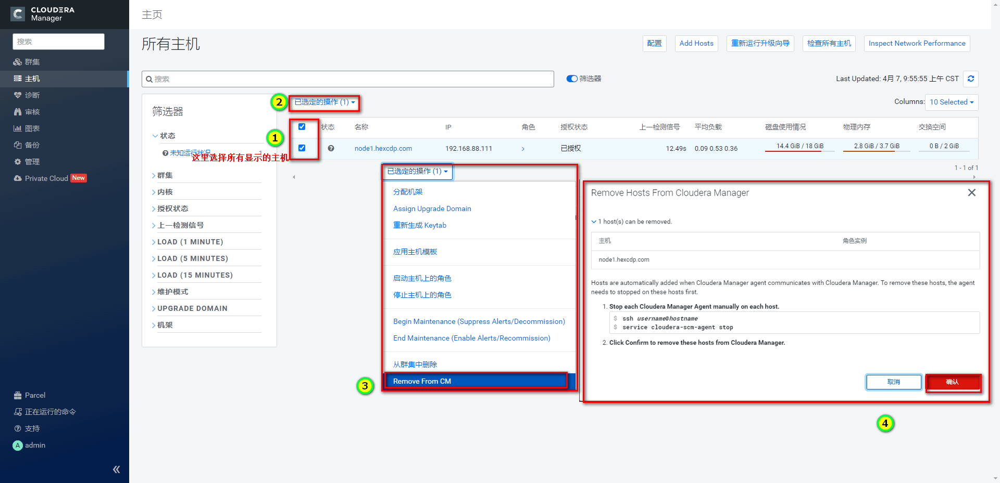

# 说明

> 由于本人在公司经常需要搭建各种各样的集群，`开发Linux集群`，测试Linux集群，CDH环境，CDP环境等等。运维太废了，活都压到我这了，于是乎写了些自动化脚本，简化下工作，同时分享出来。

> 本脚本用于`自动化配置``Linux集群`或者`CDH集群`的基础环境，包含以下功能

```shell
1.开始配置免密登录
2.开始配置hostname
3.开始配置域名映射
4.开始关闭防火墙和Selinux
5.开始设置时区
6.开始配置时钟同步
7.开始禁用透明大页
8.开始修改Linux swappiness参数
9.开始搭建本地yum源
10.开始安装docker
11.开始安装mysql
12.开始安装JDK
13.开始安装CM-Agent
14.开始安装CM-Server
```

## 1 使用说明

> 预准备工作如下,`切记，一定要做好这些预准备工作`

1. 编写好`../conf/hostConf`文件

> 每个shell都可以单独跑，需要上述的哪个配置，在配置了hostConf之后，直接去跑对应的脚本就好了。
> 
> 例如，需要配置免密登录，那么就可以跑`sh batchInstallCMAgent.sh`即可。

2. 如需安装CDH或者CDP，那么在`package`中上传`CM和CDH`的包，结构如下，切记保持一致。（安装包可从下面地址下载）

```shell
链接：https://pan.baidu.com/s/1q3vDHfBAoaejZBT-CTs_xw  提取码：6666  --来自百度网盘超级会员V5的分享
```

```shell
|-- package
|   |-- cdh
|   |   |----CDH-7.1.7-1.cdh7.1.7.p0.15945976-el7.parcel
|   |   |----CDH-7.1.7-1.cdh7.1.7.p0.15945976-el7.parcel.sha
|   |   |----CDH-7.1.7-1.cdh7.1.7.p0.15945976-el7.parcel.sha256
|   |-- cmAgentAndServer
|   |   |----allkeys.asc
|   |   |----cloudera-manager-agent-7.1.4-6363010.el7.x86_64.rpm
|   |   |----cloudera-manager-daemons-7.1.4-6363010.el7.x86_64.rpm
|   |   |----cloudera-manager-server-7.1.4-6363010.el7.x86_64.rpm
|   |   |----cloudera-manager-server-db-2-7.1.4-6363010.el7.x86_64.rpm
|   |   |----enterprise-debuginfo-7.1.4-6363010.el7.x86_64.rpm
|   |   |----manifest.json
|   |   |----mysql-connector-java-8.0.17.jar
|   |   |----openjdk8-8.0+232_9-cloudera.x86_64.rpm
|   |   |----RPM-GPG-KEY-cloudera
```

3. 将所有脚本及文件上传到集群中的一台服务器(服务器目录无要求)，在此服务器执行下面脚本即可。

```shell
sh clusterConfiguration.sh
```
### 1.1 cm安装进度查看

> 上述脚本执行完成之后，执行下面命令查看cm-server安装日志

```shell
tail -f /var/log/cloudera-scm-server/cloudera-scm-server.log
```

> 出现下述字眼表明安装成功

```shell
2022-04-06 10:38:13,169 INFO WebServerImpl:org.eclipse.jetty.server.AbstractConnector: Started ServerConnector@19e11e56{HTTP/1.1,[http/1.1]}{0.0.0.0:7180}
2022-04-06 10:38:13,171 INFO WebServerImpl:org.eclipse.jetty.server.Server: Started @317187ms
2022-04-06 10:38:13,171 INFO WebServerImpl:com.cloudera.server.cmf.WebServerImpl: Started Jetty server.
```

> 访问下述地址即可查看Cloudera Manager界面

```shell
http://ip:7180
```

## 2 cm配置

### 2.1 使用默认用户名密码登录

```
用户名: admin
密码: admin
```


### 2.2 选择付费或者试用


### 2.3 主机排除

> 因为我们配置过cm-server，所以这里先移除一下受管理的主机，不管一会儿安装不了服务




### 2.4 添加集群


### 2.5 欢迎界面


### 2.6 配置集群名称


### 2.7 指定主机


### 2.8 选择存储库


### 2.9 选择JDK


### 2.10 提供SSH登录凭据


### 2.11 安装Agents


### 2.12 安装Parcels

> 这一步花的时间比较长，耐心等待一下


> 出错了就去这两个地方看日志

```shell
/var/log/cloudera-scm-agent
/var/log/cloudera-scm-server
```

### 2.13 检查集群


### 2.14 集群设置

#### 2.14.1 选择服务

> 我这里先只选一个HDFS，其他服务后面再添加，大家可以在这里勾选所有自己需要的服务，也可以只勾选一个，后面再加其他的。


#### 2.14.2 自定义角色分配

> 根据自己情况分配角色


#### 2.14.3 数据库设置

> 脚本在初始化的时候，我给大家创建了几个数据库，大家根据自己的角色填写相应的数据库名称即可

```shell
cmserver         root root   用于CM元数据管理
cmhive           root root   用于Hive元数据管理
cmhue            root root   用于Hue元数据管理
cmreportsmanager root root   用于Reposts Manager元数据管理
```


#### 2.14.4 审核修改

> 根据自己情况，可修改默认配置，如数据存储目录等等，我这里默认


#### 2.14.5 命令详细信息


#### 2.14.6 汇总


#### 2.15 最后效果


#### 2.16 添加新服务

> 需要添加新的服务，自己在这里添加就行了

